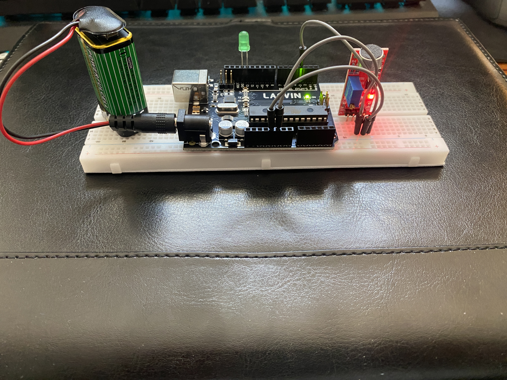
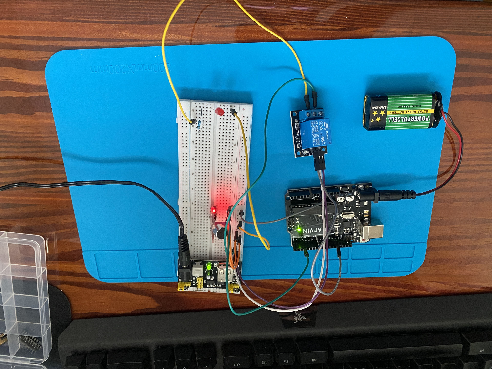
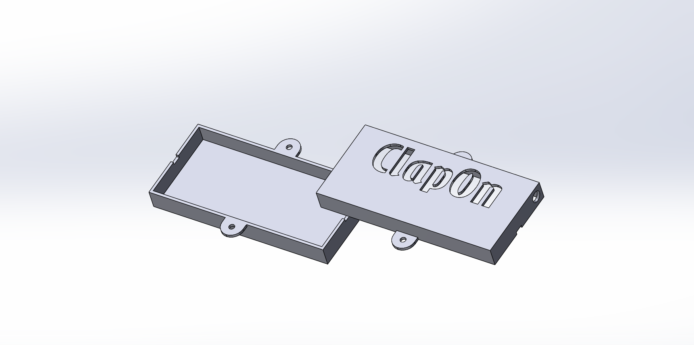

"# Clap-Activated-Light-Controller" 
## Project Overview

The Clap-Activated Light Controller is a microcontroller-based lighting system that listens for a clap through a microphone module and toggles a room light using a relay. The project was designed to explore embedded systems, sensor integration, relay control, and mechatronics system design.

While simple in concept, the project required multiple rounds of prototyping, debugging, and redesign before a reliable final solution was achieved.

## Key Skills Demonstrated
- Embedded programming
- Sensor integration
- Relay control
- Hardware debugging
- CAD design using SolidWorks
- System integration
- Iterative engineering design
 
********************************************************************************************

# Design Evolution

## Concept testing-
    The initial proof-of-concept used:

    - Arduino Uno R3
    - Sound sensor module
    - 9V battery
    - LED
     
    The objective was to verify that a sound signal could be detected and used to control an output device.
    ## Photos
    
********************************************************************************************
## Relay Addition-
    After successfully detecting sound, a relay module was introduced to allow the microcontroller to control a higher-power load.

    The updated system included:
    - Arduino Uno R3
    - Sound sensor module
    - Relay module
    - Dedicated external power supply

    The relay was controlled by the microcontroller, which received its trigger signal from the microphone sensor.
    ## Photos
    
********************************************************************************************
## Container Solidworks Model-
    To create a permanent installation, a custom enclosure was designed in SolidWorks. The enclosure provided mounting space for the electronics while also allowing access for wiring, power connections, and the microphone module.
    ## Photos
    

********************************************************************************************
## Final Design and Implementation-
    The final version replaced the Arduino Uno R3 with an ESP32-C3 Supermini.

    The ESP32-C3 was selected because:
    - Smaller physical footprint
    - Lower component count
    - Reduced power consumption
    - More than sufficient processing capability for the application

    The completed system is permanently installed and controls room lighting through clap detection.
    ## Videos
    [Watch demo](videos/final_implementation.mp4)
    |
    https://youtube.com/shorts/3NayaX7WIjI?feature=share

## Technical Specifications

    ### Hardware
    - ESP32-C3 Supermini
    - Sound sensor module
    - Relay module
    - External power supply
    - Custom SolidWorks enclosure

    ### Software
    - Arduino IDE
    - ESP32 Board Package
    - Standard Arduino Framework

## Engineering Challenges
     Several challenges were encountered during development:
    - False triggering caused by sensor behavior and floating signal conditions
    - Changes in sensor operation resulting from different power supply configurations
    - Relay integration and power management considerations
    - Calibration of the microphone trigger threshold to reduce unintended activations

    These issues were resolved through iterative testing, hardware modifications, and software debugging.

## Lessons Learned
    Through this project I gained experience with:
    - Embedded systems development
    - Sensor calibration and debugging
    - Relay-based control systems
    - Hardware/software integration
    - CAD enclosure design
    - System troubleshooting and iterative design

## Future Improvements

    Potential future enhancements include:

    - Adjustable sensitivity controls
    - Multiple-clap command recognition
    - Wireless monitoring and configuration
    - Custom PCB design
    - Battery backup functionality